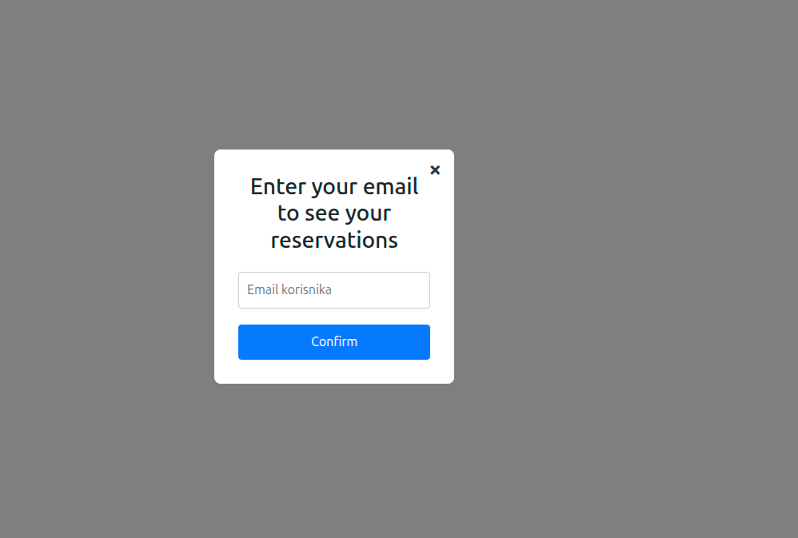
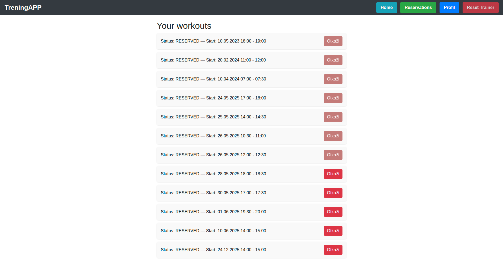
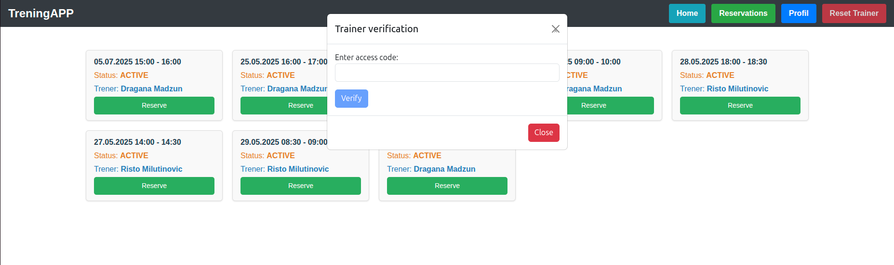
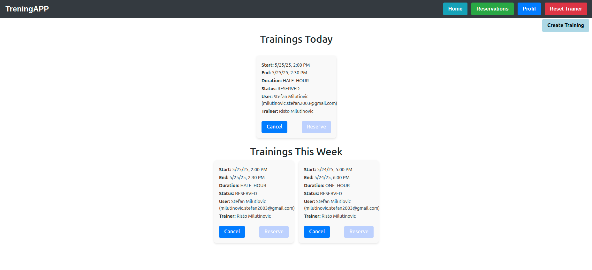
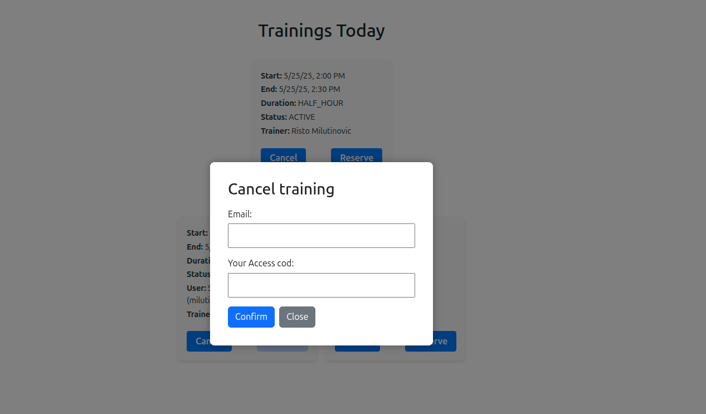
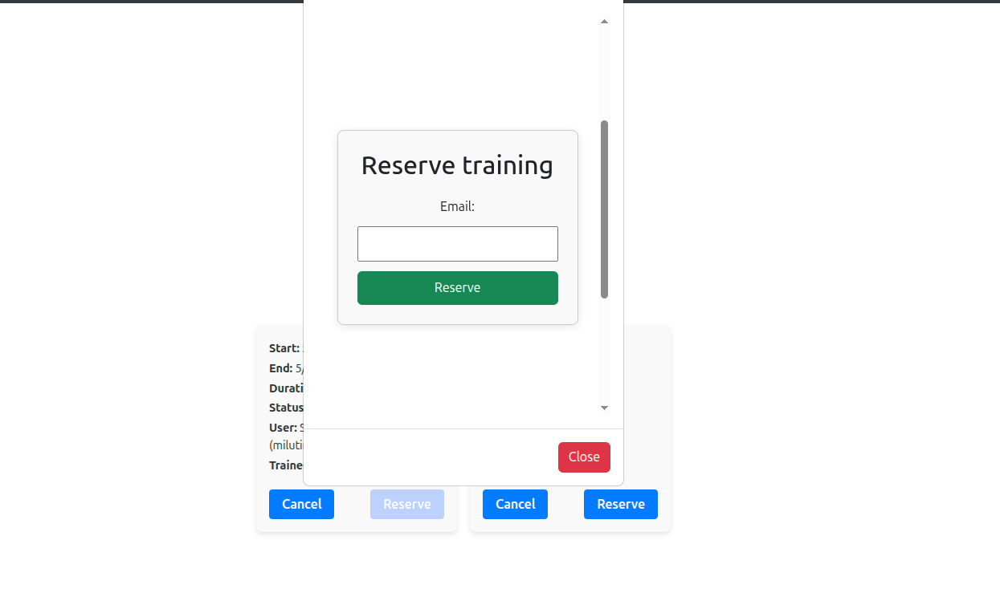
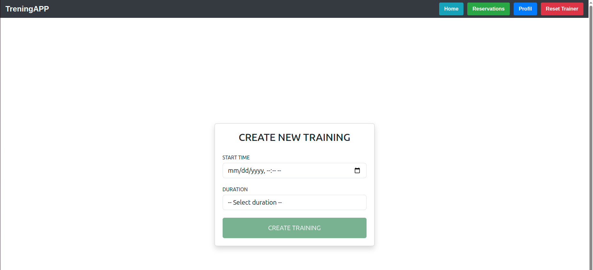

# Aplikacija za trenere

Kratak opis projekta:
Ovo je aplikacija za organizaciju sportskih aktivnosti u teretani, namenjena trenerima i korisnicima. Korisnici mogu da se prijave na već postojeće termine za trening i da ih otkažu, dok treneri imaju mogućnost da pregledaju svoje treninge, kreiraju nove termine, otkazuju ih, kao i da zakažu korisnike za bilo koji termin. Korisnici dobijaju automatske email obaveštenja prilikom zakazivanja ili otkazivanja termina.

# Funkcionalnosti

- Svaki korisnik koji postoji u bazi može da se prijavi na trening.
- Korisnik može da otkaže prethodno zakazan trening ukoliko je ostalo više od 24 sata do termina.
- Korisnici mogu da vide pregled svih svojih treninga, kako onih u prošlosti, tako i onih koji su trenutno rezervisani.
- Trener može da vidi svoje treninge za tekuću sedmicu, sa svim zakazanim terminima, uključujući podatke o korisnicima koji su rezervisali treninge.
- Trener ima jedinstveni broj za pristup aplikaciji, pregled svojih termina, kao i mogućnost zakazivanja ili otkazivanja treninga u bilo kom trenutku.

## Tehnologije

- Angular
- Spring Boot
- PostgreSQL

## Pregled aplikacije

### Početna stranica  
**URL:** http://localhost:4200/home  

Na početnoj stranici prikazuje se navigacioni meni (navbar), koji je prisutan na svim stranicama aplikacije.  
Ispod navigacije prikazani su svi slobodni termini za trening.  
Svaki termin sadrži dugme "Reserve", koje korisniku omogućava jednostavno zakazivanje treninga.

Kada korisnik klikne na dugme "Reserve", otvara se modalni prozor za potvrdu rezervacije, gde je potrebno uneti svoju email adresu:  

---

## Navigacioni meni (Navbar)

Navbar sadrži sledeće opcije:

- **Home** — vodi na početnu stranicu  
- **Reservations** — omogućava korisnicima da pregledaju svoje aktuelne i prošle rezervacije  
- **Profil** — stranica namenjena isključivo trenerima  
- **Reset Trainer** — omogućava treneru da resetuje svoj pristupni kod (access code), čime se gubi pristup stranici `/profil` dok se ne unese novi kod  

---

## Stranica Reservations  
**URL:** http://localhost:4200/reservations  

Pre nego što korisnik vidi svoje rezervacije, pojaviće se modalni prozor u kome treba da unese svoju email adresu radi potvrde identiteta.  

Nakon unosa validne email adrese, korisnik će biti preusmeren na stranicu `http://localhost:4200/reservations`, gde može da pregleda sve svoje aktuelne i prošle rezervacije i da otkaže rezervaciju ukoliko je do termina ostalo više od 24 časa.  

---

## Stranica Profil  
**URL:** http://localhost:4200/profil  

Klikom na dugme **Profil** u navigacionom meniju otvara se modalni prozor za unos pristupnog koda.  

Nakon unosa ispravnog pristupnog koda, korisnik (trener) se preusmerava na stranicu `/profil`, gde može da vidi listu treninga za tekuću nedelju.  

Trener ima mogućnost da otkaže bilo koji svoj trening u bilo kom trenutku. Prilikom otkazivanja prikazuje se prozor u kome mora uneti email korisnika i svoj pristupni kod:  

Takođe, trener može rezervisati trening ukoliko još nije zauzet:  

Na stranici **Profil**, trener ima opciju da kreira novi trening u budućnosti. Nakon klika na dugme za kreiranje treninga, biće preusmeren na novu stranicu sa formom za unos datuma i trajanja (30 ili 60 minuta):  

