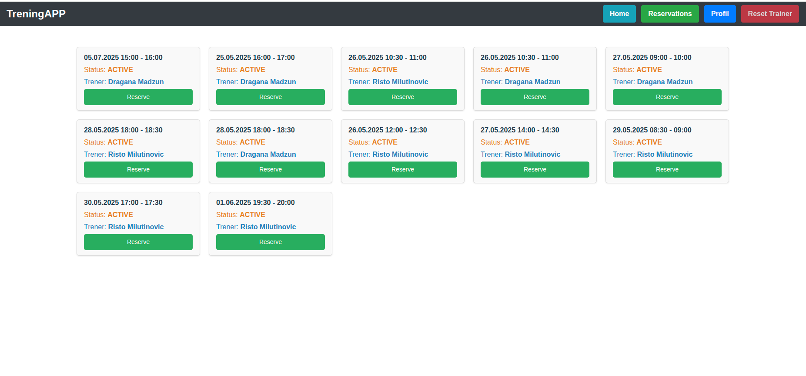
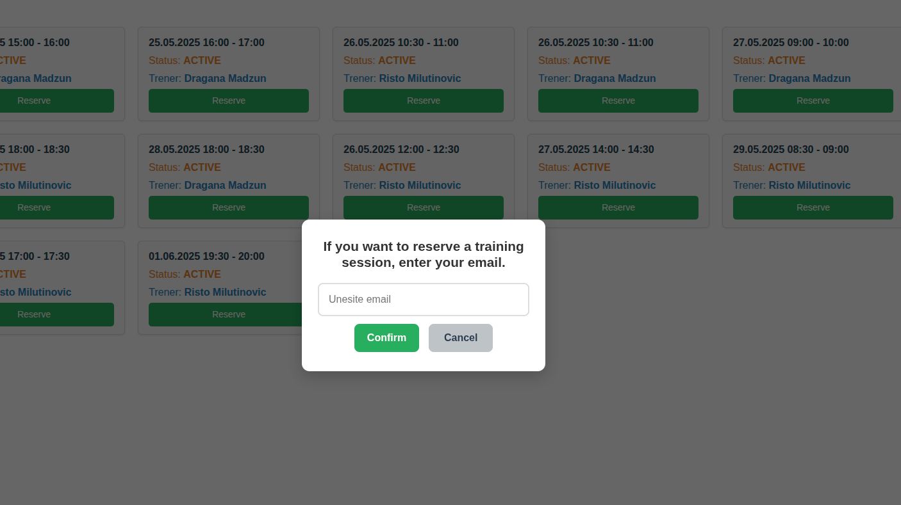

# Aplikacija za trenere

Kratak opis projekta:
Ovo je aplikacija za organizaciju sportskih aktivnosti u teretani, namenjena trenerima i korisnicima. Korisnici mogu da se prijave na već postojeće termine za trening i da ih otkažu, dok treneri imaju mogućnost da pregledaju svoje treninge, kreiraju nove termine, otkazuju ih, kao i da zakažu korisnike za bilo koji termin. Korisnici dobijaju automatske email obaveštenja prilikom zakazivanja ili otkazivanja termina.

#Funkcionalnosti
Svaki korisnik koji postoji u bazi može da se prijavi na trening.

Korisnik može da otkaže prethodno zakazan trening ukoliko je ostalo više od 24 sata do termina.

Korisnici mogu da vide pregled svih svojih treninga, kako onih u prošlosti, tako i onih koji su trenutno rezervisani.

Trener može da vidi svoje treninge za tekuću sedmicu, sa svim zakazanim terminima, uključujući podatke o korisnicima koji su rezervisali treninge.

Trener ima jedinstveni broj za pristup aplikaciji, pregled svojih termina, kao i mogućnost zakazivanja ili otkazivanja treninga u bilo kom trenutku.

 ## Technologies
- Angular
- Spring Boot
- PostgreSQL

## Pregled aplikacije

### Početna stranica 
**URL:** http://localhost:4200/home

Na početnoj stranici prikazuje se navigacioni meni (navbar), koji je prisutan na svim stranicama aplikacije.

Ispod navigacije prikazani su svi slobodni termini za trening.
Svaki termin sadrži dugme "Rezerviši", koje korisniku omogućava jednostavno zakazivanje treninga.

Kada korisnik klikne na dugme "Rezerviši", otvara se modalni prozor za potvrdu rezervacije:

